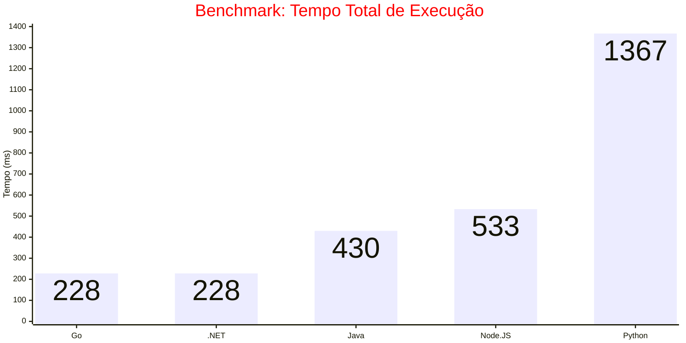
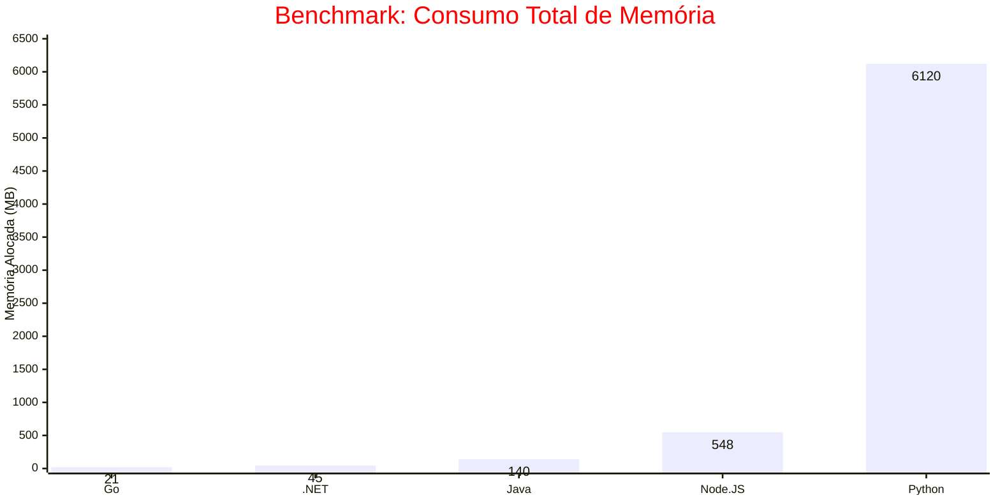

|             | .NET | Go    | Java | Node.JS | Python  |
| ----------- | ---- | ----- | ---- | ------- | ------- |
| **Tempo**   | 45   | 21.80 | 140  | 518.58  | 6120.76 |
| **Memória** | 228  | 228   | 430  | 533.24  | 1367.92 |

# language-performance-analysis
